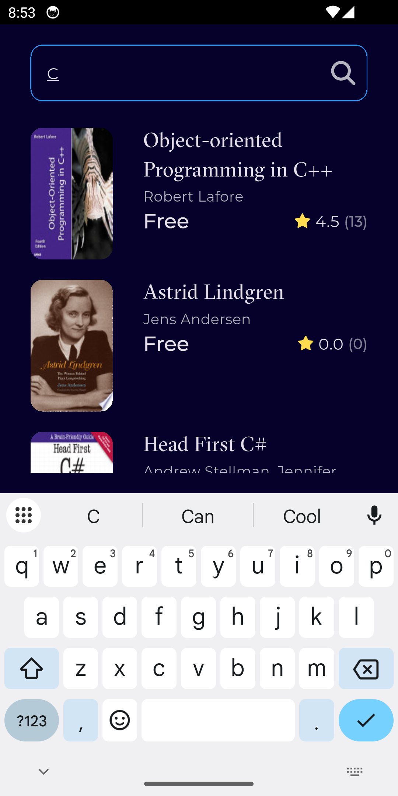
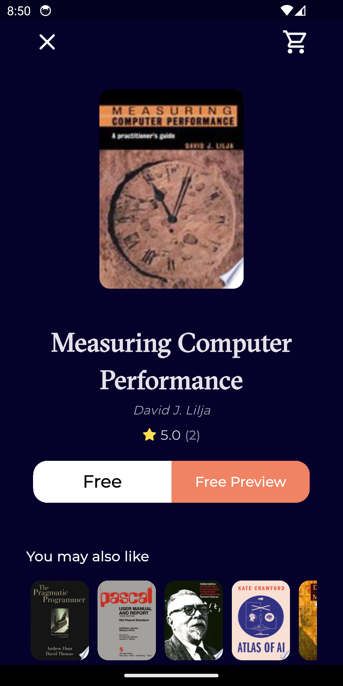

# 📚 MyBookShelf

[](https://flutter.dev/)
[](https://dart.dev/)
[](LICENSE)

MyBookShelf is a Flutter application that allows users to discover, browse, and search books using the Google Books API.
The app features a clean UI, smooth navigation, and modern Flutter architecture with Bloc state management.

<p align="center"> 
  
</p>

---
## Table of Contents
- [Features](#features)
- [Demo](#demo)
- [Tech Stack](#tech-stack)
- [Installation](#installation)
- [Future Updates](#future-updates)
- [Acknowledgements](#acknowledgements)
- [License](#license)

---

## Features

✔ Browse featured books  
✔ View newest releases  
✔ Search books by title  
✔ View detailed book information  
✔ Read book previews  
✔ Smooth scrolling & pagination   
✔ Clean and responsive UI  

---

## 🎬 Demo

### 🔵 Splash & Home Screen
<div style="display: flex; justify-content: center; gap: 20px; padding: 16px;">
  <div>
    
    <p align="center">Splash Screen</p>
  </div>
  <div>
    
    <p align="center">Home View</p>
  </div>
</div>


### 🔍 Search Feature
<div style="display: flex;justify-content: center; gap: 10px; padding: 16px;">
  
  
</div>


### 📘 Book Details & Access to Book Preview
<div style="display: flex;justify-content: center; gap: 10px; padding: 16px;">
  
  
</div>

---

## 🏗 Tech Stack

- **Flutter & Dart** – UI & application logic  
- **Bloc** – State Management  
- **MVVM (Clean Architecture)** – Maintainable code structure  
- **Google Books API** – Book data (via Dio HTTP client)  
- **Dependency Injection** – GetIt  
- **Caching & Image Loading** – cached_network_image  
- **Navigation** – go_router  
- **URL Handling** – url_launcher  
- **Fonts & Icons** – Google Fonts & FontAwesome  
- **Functional Programming** – Dartz 

---

## Installation


```bash
git clone https://github.com/YOUR_USERNAME/MyBookShelf.git
cd MyBookShelf
flutter pub get
flutter run


```
## Future Updates

- Dark mode / Light mode support
- User authentication & personalized book lists
- Offline caching for favorite books
- Advanced filtering and sorting in search
- Multi-language support
- Payment Availability

---

## Acknowledgements

- [Eng.Tharwat Samy](https://github.com/tharwatsamy) – for their excellent course on Flutter development that guided me through building MyBookShelf
- [Google Books API](https://developers.google.com/books)
- Flutter community & Bloc documentation
- Icons by [FontAwesome](https://fontawesome.com/)
- Fonts by [Google Fonts](https://fonts.google.com/)
---

## 📄 License

This project is licensed under the MIT License - view the [LICENSE](LICENSE) file for details.
